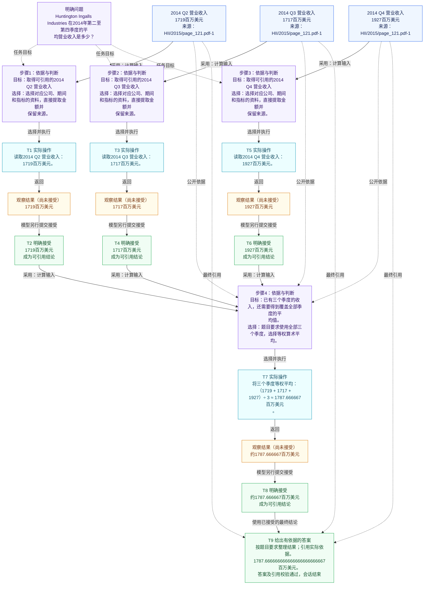

# A02：Huntington Ingalls Industries 在2014年第二至第四季度的平均营业收入是多少？

[返回轨迹索引](README.md)

来源：八任务面板。

## 问题

Huntington Ingalls Industries 在2014年第二至第四季度的平均营业收入是多少？

## 依据、推导与结果使用图

紫色节点说明目标与判断；蓝色节点表示资料或操作；黄色节点表示尚未接受的观察；绿色节点表示已接受结论或有效答案；灰色节点标记已接受但未使用的结果。

实线连接实际数据使用与操作—观察—接受；虚线表示任务目标、公开依据、引用或使用检查。图展示依赖结构，不表示并行执行；T编号保留真实提交顺序。判断文字为说明性转述，不是模型逐字原话。中间约数仅用于展示，实际计算保留完整精度。

## 提案与答案调整图

本会话没有被拒提案或答案调整。

[原始数据与字段说明](../README.md)
