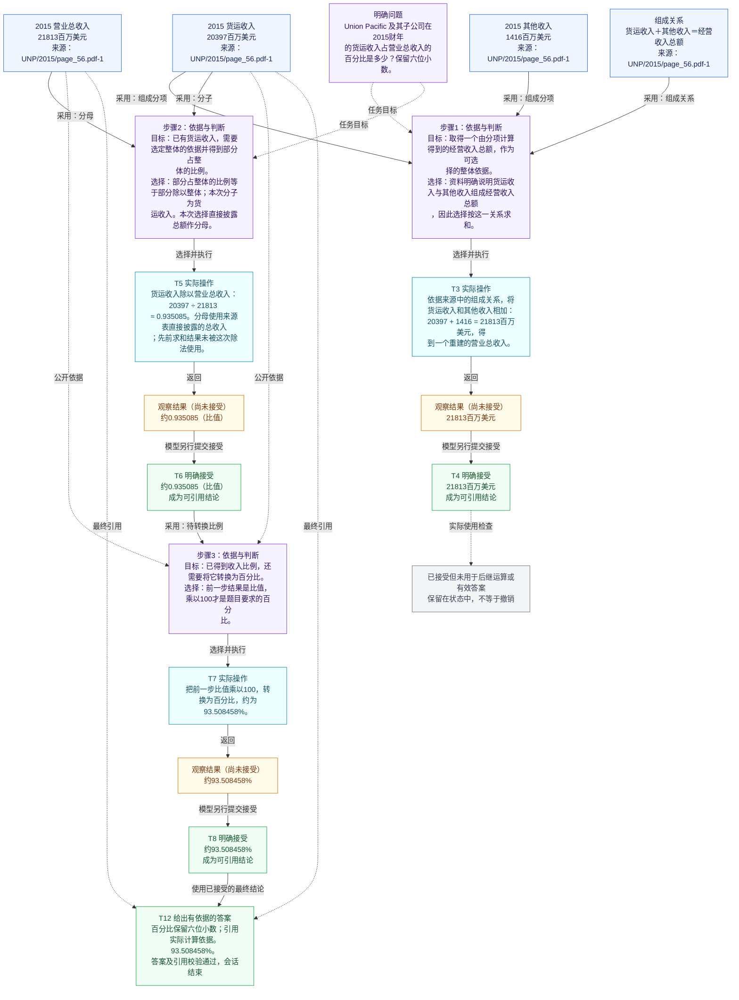

# S02：Union Pacific 及其子公司在2015财年的货运收入占营业总收入的百分比是多少？保留六位小数。

[返回轨迹索引](README.md)

来源：八任务面板。

## 问题

Union Pacific 及其子公司在2015财年的货运收入占营业总收入的百分比是多少？保留六位小数。

## 依据、推导与结果使用图

紫色节点说明目标与判断；蓝色节点表示资料或操作；黄色节点表示尚未接受的观察；绿色节点表示已接受结论或有效答案；灰色节点标记已接受但未使用的结果。

实线连接实际数据使用与操作—观察—接受；虚线表示任务目标、公开依据、引用或使用检查。图展示依赖结构，不表示并行执行；T编号保留真实提交顺序。判断文字为说明性转述，不是模型逐字原话。中间约数仅用于展示，实际计算保留完整精度。

## 提案与答案调整图

红色节点表示未通过的提案及反馈，紫色节点说明随后实际修改。动作未通过时没有执行；答案字段与引用的修改不算重新计算。详细字段差异来自事后核对，不是在线反馈逐字原文。图中分开的片段发生于不同阶段，T编号与主图一致。

```mermaid
flowchart TD
    T1["T1 提交<br/>拟用披露总额直接计算货运收入占比；本次没有执行运算。"]:::rejected
    T2["T2 提交<br/>拟用披露总额直接计算货运收入占比；本次没有执行运算。"]:::rejected
    R1["动作未准入：目标写成“取得总额”，但所选动作要求“计<br/>算比例”；依据清单顺序与所选公开候选不一致（数值分子<br/>、分母未因此互换）。"]:::rejected
    M1["随后调整<br/>继续提交直接使用披露总额的除法；目标／依据校验仍未通<br/>过，没有执行。"]:::judgment
    T3["T3 提交<br/>由分项重建总额实际执行<br/>后续观察与接受见上方主图"]:::operation
    R2["动作未准入：目标写成“取得总额”，但所选动作要求“计<br/>算比例”；依据清单顺序与所选公开候选不一致（数值分子<br/>、分母未因此互换）。"]:::rejected
    M2["随后调整<br/>改为由分项重建总额，实际执行；这不是直接除法已成功。"]:::judgment
    T9["T9 提交<br/>百分比仍提交长小数，未采用最终要求的六位小数；结果附<br/>加了币种、指标定义、指标名称、期间、范围、主体字段；<br/>引用多列“货运收入＋其他收入＝经营收入总额”的组成关<br/>系。"]:::rejected
    T10["T10 提交<br/>结果附加了币种、指标定义、指标名称、期间、范围、主体<br/>字段；引用多列步骤3接受的转换为百分比结果、步骤2接<br/>受的计算收入比例结果、步骤1接受的由分项重建总额结果<br/>、“货运收入＋其他收入＝经营收入总额”的组成关系。"]:::rejected
    R9["最终答案未通过校验；在线没有返回详细原因。"]:::rejected
    M9["随后调整<br/>将数值改为六位小数；加入引用：步骤3接受的转换为百分<br/>比结果、步骤2接受的计算收入比例结果、步骤1接受的由<br/>分项重建总额结果。该次仍未通过。没有重新计算。"]:::judgment
    T11["T11 提交<br/>百分比仍提交长小数，未采用最终要求的六位小数；结果附<br/>加了币种、指标定义、依赖清单、指标名称、期间、范围、<br/>主体字段。"]:::rejected
    R10["最终答案未通过校验；在线没有返回详细原因。"]:::rejected
    M10["随后调整<br/>添加结果中的依赖清单；数值又改回长小数；移除引用：步<br/>骤3接受的转换为百分比结果、步骤2接受的计算收入比例<br/>结果、步骤1接受的由分项重建总额结果、“货运收入＋其<br/>他收入＝经营收入总额”的组成关系。该次仍未通过。没有<br/>重新计算。"]:::judgment
    T12["T12 提交<br/>最终答案通过校验<br/>93.508458%。"]:::accepted
    R11["最终答案未通过校验；在线没有返回详细原因。"]:::rejected
    M11["随后调整<br/>删除结果中的币种、指标定义、依赖清单、指标名称、期间<br/>、范围、主体；将数值改为六位小数。本次通过，成为最终<br/>答案。没有重新计算。"]:::judgment
    T1 -->|"收到反馈"| R1
    R1 -->|"随后实际变化"| M1
    M1 -->|"下一次提交"| T2
    T2 -->|"收到反馈"| R2
    R2 -->|"随后实际变化"| M2
    M2 -->|"下一次提交"| T3
    T9 -->|"收到反馈"| R9
    R9 -->|"随后实际变化"| M9
    M9 -->|"下一次提交"| T10
    T10 -->|"收到反馈"| R10
    R10 -->|"随后实际变化"| M10
    M10 -->|"下一次提交"| T11
    T11 -->|"收到反馈"| R11
    R11 -->|"随后实际变化"| M11
    M11 -->|"下一次提交"| T12
    classDef evidence fill:#eff6ff,stroke:#2563eb,color:#172554
    classDef judgment fill:#f5f3ff,stroke:#7c3aed,color:#2e1065
    classDef operation fill:#ecfeff,stroke:#0891b2,color:#164e63
    classDef observation fill:#fffbeb,stroke:#d97706,color:#78350f
    classDef accepted fill:#f0fdf4,stroke:#16a34a,color:#14532d
    classDef rejected fill:#fff1f2,stroke:#e11d48,color:#881337
    classDef unused fill:#f3f4f6,stroke:#6b7280,color:#374151
```

[原始数据与字段说明](../README.md)
