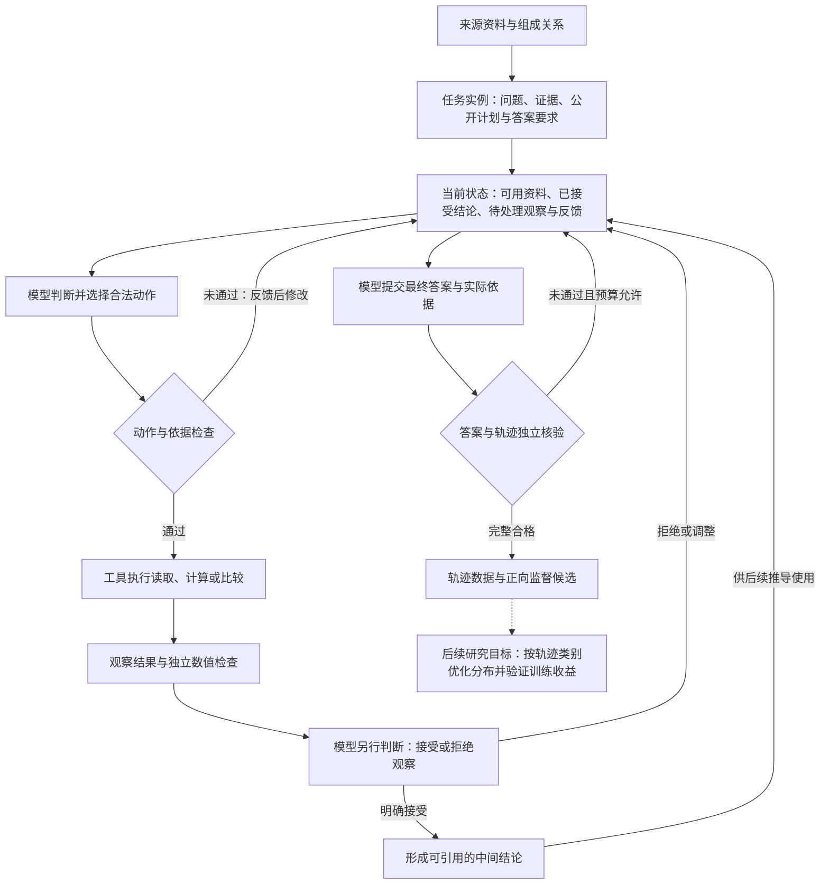

# 当前 Agent、QA 链路与轨迹合成设计概览

截至2026-09-07，以当前 QA vNext 和已完成的跨来源绑定试验为准。本文概述设计与能力边界；较早的两阶段动作选择 Agent 审计属于历史版本，不能直接当作当前实现说明。

## 1. 整体设计

目标是合成**有来源依据、可验证、能追踪中间结果如何被使用的 Agent 轨迹**。金融是当前主要验证领域，整体框架将领域证据、任务规则、模型决策和验证分开。

- **任务与环境**提供问题、真实来源、公开计划骨架、允许的操作及判断规则。当前实验以预先绑定的有限证据为主。
- **模型**负责选择动作、声明采用的依据和目标、判断观察是否接受，以及提交答案。它承担这些公开选择，不由宿主补写决策或代为接受结果。
- **工具与验证器**负责实际运算，以及数值、单位、期间、来源和依赖关系检查。模型的动作选择、工具的计算结果、模型的明确接受是不同事件。
- **状态**保留已经接受的结论和纠正历史。后续动作只能使用当前任务中实际可用、已接受的结论。

因此，当前主要研究对象是**在公开计划与合法候选约束下，模型能否完成有依据的选择、执行、接受和继续推导**。现有结果尚不支持一般自主规划、开放检索或内部信念修订的能力结论。

## 2. QA 链路的广度与深度

### 广度

统一目录注册了**11类题型**；原固定来源面板中**8类已有真实模型完整成功见证**：

| 题型 | 主要问题结构 | 已见完整轨迹的语义操作深度 |
| --- | --- | ---: |
| 事实读取 | 从资料中取得指定指标 | 0 |
| 跨指标比较 | 比较同一期两个指标的高低和差额 | 1 |
| 时间增长率 | 两期金额 → 百分比变化 | 1 |
| 时间平均值 | 多期金额 → 平均值 | 1 |
| 时间金额变化 | 两期金额 → 带方向的金额差 | 1 |
| 注册比值 | 指定分子与分母 → 比值 | 1 |
| 增长率绝对差 | 两条增长率分支 → 差值 → 绝对值 | 3 |
| 部分占整体 | 披露总额或重建总额 → 比值 → 百分比 | 2或3 |

另外3类——普通比较、跨主体增长比较、利润率目标差——在当前固定来源域中仍缺少满足要求的绑定，不能把“已注册”写成“已可稳定生成”。这里的跨指标比较与普通比较有不同的指标兼容规则，不是重复计数。

最新扩展增加的是**同一占比题型的实例广度**：UNP 2016、JPM 2014、JPM 2015三个主体／期间／指标绑定，没有增加题型数量。

### 深度

深度按实际依赖路径衡量，不按对话轮数或尝试次数计数：

- **结构深度**：最长的操作依赖链，读取数据也计一层；当前完整轨迹最高见到4。
- **语义操作深度**：最长依赖链上的实质运算；单纯读取不增加这一深度，当前最高见到3。
- **可观察选择依赖深度**：有语义区别的选择如何依赖此前选择；当前完整 Share 轨迹见到2。已有深度3的增长率差任务，其这一指标仍为0，因为按给定计划执行不等于发现新路线。

直接披露占比链是“除法 → 百分比转换”，语义深度2；真正使用重建结果的链是“分项求和 → 除法 → 百分比转换”，深度3。做过求和却未使用它，不会把最终支持链加深。以上均不是模型隐藏推理深度。

## 3. 轨迹合成的核心设计

**先区分任务、来源和表达。** “解决什么语义问题”“绑定哪组真实证据”“问题怎样措辞”分别表示。改变措辞不自动产生新任务，也不算新的推导路线；新增公司或期间属于来源实例扩展。

**轨迹在执行过程中形成。** 保存“依据与判断 → 实际操作 → 观察 → 明确接受 → 后续消费”，保留未执行提案和实际纠正。不会先算出答案，再补写一段归属于模型的过程。

**不同路线必须有真实依赖差异。** 例如占比的分母可以来自披露证据，也可以来自本会话求和并接受的结论。仅有措辞变化、不同动作排列或闲置的求和结果，不能证明采用了另一种最终支持机制。比较只在同一任务、来源与规则下进行，并保留有意义的调整历史。

**成功与多样性分别衡量。** 原八任务面板为15/16完整合格；后续原Share任务探索为3/8，获得直接／重建两种有效支持机制，在更新后的有限比较规则下形成3个行为类别。3个类别不等于3种财务公式，也不代表所有可能路线已被穷尽。不同实验条件的比例不合并。

**监督数据保留实际输入与响应。** 正向候选只取完整合格会话中的准入提交；失败前缀和未准入目标不拼成成功样本。当前审阅包来自上述两批：18条合格轨迹、134条监督记录。分布优化的设计目标是在固定任务占比下调整同任务轨迹类别的采样权重；本轮 QA vNext 尚未实施相应 Student 训练收益验证或 VTDO 更新。

## 4. 目前的主要缺陷

1. **最终答案提交是当前最明确的瓶颈。** 最新三个新绑定的12个会话全部已算出并接受百分比，但完整合格为0/12。主要失败涉及多余／缺失的结果字段、数值类型、六位小数要求及引用与实际支持不一致。应区分“计算推进成功”和“完整QA成功”，也不能据此证明机制无法迁移。
2. **接口遵循负担大，错误恢复信息不足。** 完整依据清单、精确引用和状态标识容易反复出错；Final常只反馈未通过，模型难以定位具体差异。提高反馈可用性是合理改进方向，效果仍需新实验验证，不能用宿主代写结果替代。
3. **自主性和知识修订能力有限。** 计划与合法空间主要由环境提供；目前支持接受／拒绝待处理观察，不支持撤回已接受结论并同步使后继结论失效。尚未建立开放检索、冲突证据处理和广泛不确定性推理的模型证据。
4. **来源与有效路线覆盖仍窄。** 8类面板主要各用一个固定任务重复采样，多路线成功证据集中于一个Share任务；最新跨绑定未取得完整有效迁移见证。不能由少量重复会话推断稳定的金融泛化能力。
5. **轨迹分类与下游价值尚未闭合为通用能力。** 当前类别来自有限任务和明确规则；更复杂行为可能无法判定。已知来源存在开发接触，尚无绑定的独立评价集；更多类别是否改善学习，以及分布优化是否优于普通采样，都未得到当前链路的训练实验证据。

优先建议：先验证更清晰的Final合同与定位反馈能否提高跨来源完整成功率，再扩充任务与真实支持路线，最后进行独立评价和等预算训练比较。这是后续建议，不是已经取得的结果。

## 依据与入口

- [QA统一入口与职责边界](finance_qa_vnext_unified_entry_source_audit_revisions.md)
- [八任务面板：覆盖与实际深度](finance_qa_vnext_fixed_task_panel_collection.md)
- [支持机制与有限行为类别](finance_qa_vnext_support_transition_grounding_measurement.md)
- [最新跨来源绑定结果与Final瓶颈](finance_qa_vnext_cross_binding_dual_support_transfer_pilot.md)
- [现有合格轨迹图](../data/qa_vnext_revised_trajectories/review/README.md)
