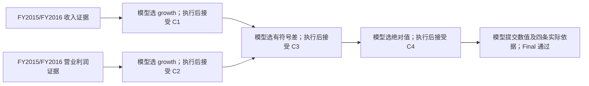

# H0/H1/H2：接口简化与有限方法开放的责任对照

## 1. 范围与审计来源

本轮响应“参照审计继续实验”，实施《本轮审计与后续实验修订方案》的新优先级。
审计原文 SHA-256：`ecbd7f870150564b2ea6afbb12d73c7c798ad74b073d6567c8bbfd7f8e0a98e6`。
前继结果提交为 `d91f0e55d4a67dd2c8b183939d979ec3ed6c4226`。

审计接受的历史支持转换商测量保持原状态；附件审阅的是旧测量材料，不能作为后续
Final 发布修订的运行证据。仓库已有的 Final 六会话结果也不重跑，不进入本轮分母。
本轮只检验有限工具环境中 Harness 与模型的责任分配，不恢复旧主线，不训练 Student，
不更新 VTDO 权重，不检验一般知识撤销、替换或后代失效传播。

本文前半部分在调用前冻结。冻结副本、源码提交、模型参数、六个初始实际 HTTP 请求、
十二条注册及测量规则保存于新阶段 `preparation/`。结果只在固定运行完成后追加。

## 2. 两个原任务与三个独立生成条件

| 对象 | 固定内容 |
| --- | --- |
| S | 原 Union Pacific FY2015 Share 任务；FinQA `UNP/2015/page_56.pdf-1`；货运收入占营业收入百分比；原披露总额及完整非重叠部件关系 |
| B | 原 CDW FY2015→FY2016 收入与营业利润增长率绝对百分点差；FinQA `CDW/2017/page_38.pdf-1`；四条原始金额证据 |
| H0 | 原公开计划、原绑定合法候选、原完整 Action/Update 提交与原准入；共同补齐 Final 规则 |
| H1 | 同 H0 的公开计划和可执行候选；简短引用与显式整观察接受；保留模型自己的动作选择 |
| H2 | 同样采用简化交互框架；给问题、原证据、定义、有限工具规则、已接受结果；模型提出子目标、短理由、操作及有序输入 |

H0/H1 的动作集合来自原 `ShareTaskAdapter` / `ProgramTaskAdapter`，没有借机扩大或缩小。
H2 不调用原候选生成函数来放行动作，不按参考节点名验证，也不读取参考图来生成下一步。
H2 请求采用正面字段清单：不包含 `program_skeleton`、节点角色映射、拓扑元数据、
完整后继义务、绑定正确候选或原目录解析对象。Reference Oracle 仅在 Final 后验核验答案。

H0/H1/H2 分别是 `Gamma_H0`、`Gamma_H1`、`Gamma_H2`，不能混成一个采样分布。
H1−H0、H2−H1 都是设计包的有限对照，不识别单字段或单句提示的因果贡献。

## 3. 新语言的责任界限

新接口版本：`harness_responsibility_compact.v1`。旧响应不按新语言重新解释。

H1 Action 必须明确提交 `kind/state_id/action`，其中 `action` 是实际展示的单一候选别名。
Host 根据这项明确选择绑定原候选的完整操作、输入、参数、依据和预期产物。
模型没有重新独立生成这些展开字段；完整候选集合也属于 Host 的展示记录。

H2 Action 必须提交 `kind/state_id/subgoal/reason/operation/inputs/parameters`。
短理由仅与真实选择一起记录，不要求列举假想方案、不强制不确定性或自我纠错，
也不解释成模型的私有思考过程。

H1/H2 Update 必须明确提交 `kind/state_id/observation/disposition`。
`accept` 的公开语义就是接受所指观察的**整个原始命题**，不是 Host 猜测或替模型接受。
缺少对象、错别名、未来 Claim、Observation 冒充 Claim、跨任务长 ID 均不能模糊修复。
E/C/O/A 是会话局部的一一对应别名；`Tn` 精确绑定当前提交状态。别名表随每轮留存。

H1 中原协议要求的候选清单、观察命题、确定性后继字段被明确标为 SYSTEM 派生。
原 `next_subgoal` 字段展开为排序后允许集合的首项，仅充当内部调度占位符，不是模型判断，
不执行下一步；后续实际 Action 仍必须由模型另行选择。H2 没有这份参考义务清单。

每轮保留实际模型 `response.txt`、解析对象、独立 `language_binding.json`、准入 Receipt、
实际执行输入、观察、明确接受的 Claim 和后继状态。原始响应从不被展开 JSON 覆盖。
数值执行前读回原响应、语言绑定和 Receipt；未经准入不执行，未经接受不消费。

## 4. H2 有限合法组合及限制

S 使用原三个工具：`relation_sum`、`share_ratio`、`scale_percent`，复用原来源语义准入。
求和必须引用明确的完整、互不重叠部件关系；支持部件顺序交换。
分母必须是合法披露总额或已接受的重建总额。禁止通过数值碰巧相等来编造部件关系。
这是任务族受限的 Share 语义工具，不声称支持任意分子、任意比例或任意代数变换。

B 使用原四类算子：`lookup`、`growth`、`signed_percentage_point_gap`、
`absolute_percentage_point_gap`。实际执行与独立公式验证继续使用已注册实现。
新准入维护实际来源传播的语义类型：金额、百分比、百分点，以及指标、定义、单位、
币种、主体、期间、范围和来源。增长率采用 `(later-earlier)/abs(earlier)*100`；
有符号差采用第二输入减第一输入；绝对值保留百分点单位。

H2 可直接用原始金额证据算增长率，也可先 `lookup` 再消费结果，允许两类输入混合。
两个增长率的减法顺序可以交换，再取绝对值；允许模型重新执行、建立未必有用的合法结果，
但这些不会自动计为更高训练价值。原参考 B 需要八次 Action；合法直接组合可只需四次，
这是开放方法空间的设计差异，不是偷偷把旧八节点轨迹缩短后仍称为同一完整行为。

零调用控制必须证明直接输入、混合 lookup 和反向差值均能形成通过原数值答案标准的 Final。
同样必须证明错误期间、跨指标增长、错误单位、未来依赖与缺失实际引用被拒绝。
模型在线未使用这些替代组合时，局部控制也不能冒充模型见证。

## 5. 所有条件共同的 Final

外层严格为 `kind/state_id/answer_claim_id/result/citations`；result 严格只含 `value/unit`。
选择当前已接受的可答 Claim，不能存在待处理观察；引用须与该 Claim 的实际 Evidence
lineage 唯一集合完全一致，不能替换成所有可见证据或未执行支持。

S 保留 Decimal precision 50、ROUND_HALF_EVEN、量化 `0.000001`，值是六位小数字符串，
单位严格 `percent`。B 保留 Decimal precision 28、ROUND_HALF_EVEN 和原答案核验语义，
公开要求保留被选结果原精度，不额外套用 Share 六位量化，单位严格 `percentage_points`。
Final 数值、单位和引用由模型自己提交；Host 不填正确答案，也不修正错误结果。
三条件共同发布完整规则，并提供字段、值投影、单位、被选 Claim 和实际引用的针对性诊断。
诊断只比较当前公开 Claim，不执行新的财务操作或泄露隐藏 Oracle 答案。

## 6. 固定预算、顺序和停止规则

两个任务 × 三条件 × 两个独立新会话，共十二会话。每条件下两个任务各占 1/2。
同一中性系统提示，不叠加历史 N/E 重建偏好。

第一波固定启动顺序：S_H0_01、B_H0_01、S_H1_01、B_H1_01、S_H2_01、B_H2_01。
第二波相同顺序、后缀 02。每波最多六会话并行，波间屏障；并行 HTTP 实际到达次序不固定。
顺序在调用前注册，不依据成功、路线、签名或错误数量调整。

沿用 `deepseek-v4-pro`、thinking disabled、temperature 0.7、top_p 1、max_tokens 8192、
JSON object。模型端可接受名称仍为原传输的 `deepseek-v4-pro` / `deepseek-v4-pro-0813`；
不声称供应商提供不可变模型快照。单 HTTP 硬截止 180 秒、连接 30 秒。

单会话最多 12 次实际 Action、32 次模型提交和 32 次 Provider attempt；总 attempt ≤384。
实际 HTTP 请求体上限 98,304 字节，单次保留 Token 上界 107,520，总保留上界 41,287,680。
成功立即结束；没有网络自动重试、模型回退、失败替换、在线续跑或补采样。
普通模型失败不改变后续注册；若出现工件完整性／内部故障，已启动波完成记录，
尚未启动注册记为未知，不删行，也不凭修复重新消费同一轮授权。

实际 Provider usage、输入／输出字节及调用量逐会话单独记录，缺失 usage 保持未知。
相同提交上限不等于相同实际计算成本；H0/H1/H2 的请求长度本来就是干预的一部分。
不加载 Student，无训练 GPU 消费；网络会话并行与 CPU 验证足以覆盖本轮工作。

## 7. 资格、只读审计和有限行为描述

`q_(task,condition) = 完整有效会话数 / 2`；已知失败与证据缺失未知分列，原分母不变。
独立只读审计核对实际请求和原 Provider 字节、精确展开、准入、生产—观察—接受—消费顺序、
实际执行输入及独立数值验证、最终结果和真实支持。公开语言准入函数与运行器共享，
但执行结果由独立公式 verifier 核验；审计不调用生产 executor、Runtime.run/step 或 API。

接口错误码集合调用前冻结。候选集合、内容复述、观察复述、引用和状态错误归入接口负担；
Final 单列；语义／阶段错误单列；不能解释的码保持 `unclassified`，不临场改规则。
H2 无效引用既可能是机械错误也可能是错误依赖判断，报告代码及实际对象，不作单因果归因。

决策来源记录实际操作及输入是否在请求中作为绑定候选完整出现。
H0/H1 的候选选择不能称为自行构造方法；H2 只有在未获完整候选、执行前提出、
实际执行并被最终答案消费时，才构成有限环境的方法构造见证。

本轮**不继承旧完整行为商**。仅冻结一种描述性有效方法签名：从 Final Claim 的真实支持树
递归记录算子、参数、有序输入和 Evidence 身份；折叠透明 lookup；仅将关系求和的两个
部件输入对称化；有符号差输入方向保留。措辞、调度和未使用工作不进入这个方法签名，
但原事件仍完整留存。这不是把它们从“完整行为”中抹掉，也不是训练价值估计。
只在同任务同条件内列签名，不把跨条件类别混合成新的 π 更新。

报告同时给出被接受结果是否实际被消费、Final 支持祖先和已接受但未使用的结果。
没有有效 Final 的轨迹不进入有效方法签名集合。

## 8. 实现与复核入口

实现位于 `src/trusted_synthesis/experiments/finance_qa_vnext_harness_responsibility/`：
`adapters.py` 是独立有限语义准入；`interface.py` 是新语言与共同 Final；`runtime.py`
记录责任分离事件；`audit.py` 做只读核验与方法支持图；`stage.py` 冻结并执行固定人口。
旧 adapter、旧协议、旧运行器和旧正式工件不改写。

专门控制：`tests/test_qa_vnext_harness_responsibility.py`。仅覆盖本轮新增风险。
运行入口：

```bash
trusted_data_synthesis/.venv/bin/python -m trusted_synthesis.experiments.finance_qa_vnext_harness_responsibility.stage prepare
trusted_data_synthesis/.venv/bin/python -m trusted_synthesis.experiments.finance_qa_vnext_harness_responsibility.stage run
trusted_data_synthesis/.venv/bin/python -m trusted_synthesis.experiments.finance_qa_vnext_harness_responsibility.stage verify
```

`prepare`/`run` 均拒绝覆盖既存目标。`verify` 只核对新工件封存，不再发模型请求。

## 9. 结果

调用前状态：尚未启动在线会话。固定运行结果及局限将在执行结束后追加；
`preparation/design_at_freeze.md` 永远保留调用前版本，不用事后结果重写预注册。

### 9.1 执行后结论与冻结标识

以下为固定运行结束后追加的结果。十二条注册全部启动、全部独立结束，未替换、未补样、
未在线续跑。**六个任务×条件单元均为 2/2 完整有效；已知失败 0，未知 0。**
这不是成功率提升的证据，因为 H0 同样全部成功；本轮更有信息量的是实际机械错误、
表达成本与方法组织责任的变化。

| 冻结／封存对象 | 标识 |
| --- | --- |
| 源码冻结提交 | `4ded7d9a261de607dad4b9016133a28d00f70fad` |
| 条件 ID 后缀 | `138327b4bc2dccb9447f453b97a93ef1266df5c52715743908e40b247d842410` |
| 测量规则 ID 后缀 | `825576e671bf7d556a9245e21fe0fcaac3986f4df3903b2bca3eaab1aae40367` |
| 准备 Manifest 后缀 | `27e7412c1b85ae6c58b0fdf248c3a052c04905e822ee4ddf9d94016347dccaee` |
| 执行 Manifest 后缀 | `ea5da96679f24d116d636533f89a33348689870e41c7aafa498a8f77fa9688a0` |
| 结果报告 ID 后缀 | `8456267b64d0dcd90be6a7320947dd31935e8842fe3f8d84acc8da4d5d70eee6` |

正式入口：[执行报告](../artifacts/qa_vnext_harness_responsibility/harness_v1_20260907/execution/report.md)、
[机器可读完整报告](../artifacts/qa_vnext_harness_responsibility/harness_v1_20260907/execution/report.json)、
[调用前冻结条件](../artifacts/qa_vnext_harness_responsibility/harness_v1_20260907/preparation/condition.json)、
[22 项零调用控制日志](../artifacts/qa_vnext_harness_responsibility/harness_v1_20260907/preparation/controls_stdout.txt)。

两个任务的所有 Final 均与原答案标准一致：S 为 `93.508458 percent`；
B 为 `2.757665967870018967554982530 percentage_points`。十二个会话都只提交了一次 Final，
首次均通过；本轮没有 Final 格式修补、错误答案代填或 Final 失败后的补采样。

### 9.2 分任务结果与实际成本

| 条件 | 任务 | 完整有效 / 2 | 已知失败／未知 | API 提交 | 实际 Action | 接口拒绝 | 语义／阶段拒绝 | Prompt Tokens | Completion Tokens |
| --- | --- | --- | --- | --- | --- | --- | --- | --- | --- |
| H0 | S | 2/2 | 0／0 | 16 | 6 | 2 | 0 | 331,519 | 10,668 |
| H0 | B | 2/2 | 0／0 | 34 | 16 | 0 | 0 | 721,820 | 20,004 |
| H1 | S | 2/2 | 0／0 | 12 | 5 | 0 | 0 | 197,191 | 432 |
| H1 | B | 2/2 | 0／0 | 34 | 16 | 0 | 0 | 576,752 | 1,114 |
| H2 | S | 2/2 | 0／0 | 10 | 4 | 0 | 0 | 100,103 | 742 |
| H2 | B | 2/2 | 0／0 | 19 | 8 | 0 | 1 | 127,448 | 1,397 |

这是完整注册人口的实际计数：125 次 Provider attempt／模型提交、55 次真实 Action、
55 次明确接受、12 次有效 Final、3 次拒绝；`55 + 55 + 12 + 3 = 125`。
无预算外调用；125 小于预注册上限 384。所有返回的模型名称为 `deepseek-v4-pro`，
未发现模型条件偏离标记。

实际总 usage：Prompt 2,054,833、Completion 34,357、Total 2,089,190 Tokens。
Prompt cache hit 939,776、miss 1,115,057，与 Prompt 总量相加一致。
这五项 usage 在 125 个 attempt 上完整；`reasoning_tokens` 在 125 次都未提供，保持未知，
不能将缺失数字报告成实测 0。配置仍为 thinking disabled，且没有非空 reasoning content 偏离标记。
这里不折算货币成本，也不将缓存命中量混作未消费的输入。

| 条件（各四会话） | API 次数 | 实际 Action | Total Tokens | 实际请求体总字节 | 模型内容总字节 |
| --- | --- | --- | --- | --- | --- |
| H0 | 50 | 22 | 1,084,011 | 3,753,116 | 76,773 |
| H1 | 46 | 21 | 775,489 | 2,740,956 | 3,933 |
| H2 | 29 | 12 | 229,690 | 781,398 | 7,193 |

H1 相对 H0 的本次 Total Tokens 低约 28.46%，但 Share 支持选择、无用操作和拒绝数量也不同，
不能把这个总差值完全归因于压缩某个字段。更干净的局部比较是 B：H0/H1 都为每会话八次
Action、十七次提交，执行同一公开计划，Total Tokens 由 741,824 降为 577,866，约低 22.10%；
该结果支持减少机械表达的工程价值，不意味着自主规划能力提升。

H2 相对 H1 的本次 Total Tokens 低约 70.38%。这个差值同时包含更少的计划信息、更短的交互
以及 B 从八个实际动作变为四个的合法组合变化；它不是“纯自主性”的单一因果效应。
H2 Completion Tokens 高于 H1 也不矛盾：H2 需要自己提出子目标、理由、操作和输入，
H1 主要选择候选 ID。解释更长本身不构成更高推理质量。

调用前六个实际初始 HTTP 请求体分别为：S_H0 71,184、S_H1 56,231、S_H2 31,134、
B_H0 74,632、B_H1 59,711、B_H2 20,477 字节，均在固定 98,304 字节上限内。
运行期间没有提高上下文、输出或提交预算。

### 9.3 三次拒绝的具体机制

1. **S_H0_01，第 1 次提交：**选择了合法披露分母比例，但 `decision.basis.evidence_refs`
   的两个 ID 顺序与已展示候选相反。它们的集合相同，操作和有序计算输入本身没有变；
   原完整协议要求该对象精确复述，因此以 `admission.public_judgment` 拒绝，未执行比例。
2. **S_H0_02，第 1 次提交：**出现同一数组复述顺序错误，按同一原规则拒绝。H1/H2 不再要求
   模型抄写这个由已选操作决定的依据数组，本次未出现同类拒绝。不能由两例外推稳定错误率。
3. **B_H2_01，第 5 次提交：**模型已分别接受两个增长率，却将 `[C1,C2]` 交给只接受一个
   已有百分点结果的 `absolute_percentage_point_gap`。以 `semantic.arity` 拒绝；没有执行、
   没有生成观察或 Claim。第 6 次提交改为 `signed_percentage_point_gap(C1,C2)`，明确接受后，
   再对该差值使用绝对值工具。拒绝反馈没有给出参考计划或绑定正确下一步。

第三例体现的是本工具集中的实际方法组合／工具语义失配，不是要求多写解释后“修好格式”。
在冻结分类中保留为 `semantic_or_phase`；三条原始错误响应、Receipt 和后续真实操作全部留存。
本轮没有根据看到的结果重定义错误码集合或方法签名。

### 9.4 H2 的实际方法组织见证

H2 的两个 B 会话均由模型选择四条原始金额证据的配对：收入 FY2015/FY2016 与营业利润
FY2015/FY2016。模型没有收到四个已绑定 lookup 节点或后继图，直接提出两个增长率计算，
再组合差值与绝对值。每个中间结果都先经过真实执行和明确接受，才成为后续输入。

以 [B_H2_01 完整记录](../artifacts/qa_vnext_harness_responsibility/harness_v1_20260907/execution/sessions/B_H2_01/review.md)
为例：



图仅表示真实有效支持链，不抹掉第 5 次被拒提案；拒绝见上节和原始事件。
两个增长率分别为 `7.646646700593592892283292400` 与 `10.40431266846361185983827493`。
B_H2_01 先作营业利润增长率减收入增长率，得到正差；
[B_H2_02](../artifacts/qa_vnext_harness_responsibility/harness_v1_20260907/execution/sessions/B_H2_02/review.md)
采用相反方向，得到负差，再取绝对值。两者最终都通过独立原答案 Oracle。

这说明必要判断已经从“抄写绑定候选”转移到模型实际输出并落实。
但它仍是给定证据和有限语义工具下的组合见证，不是新算法发现、最优计划证明、
开放研究 Agent 泛化或隐私思考过程的证据。工具集合与语义检查仍由 Harness 提供。

### 9.5 实际支持、未使用工作和签名边界

| 会话 | Action／提交 | 最终实际支持或组合 | 接受但未进入 Final 支持祖先的结果 |
| --- | --- | --- | --- |
| S_H0_01 | 3／8 | 披露总额 D | 一个重建总额 |
| S_H0_02 | 3／8 | 重建总额 R，真实消费求和 Claim | 无 |
| S_H1_01 | 2／5 | 披露总额 D | 无 |
| S_H1_02 | 3／7 | 披露总额 D | 一个重建总额 |
| S_H2_01 | 2／5 | 披露总额 D | 无 |
| S_H2_02 | 2／5 | 披露总额 D | 无 |
| B_H0_01 | 8／17 | 原计划，含四个 lookup | 无 |
| B_H0_02 | 8／17 | 原计划，含四个 lookup | 无 |
| B_H1_01 | 8／17 | 同一原计划，简化提交 | 无 |
| B_H1_02 | 8／17 | 同一原计划，简化提交 | 无 |
| B_H2_01 | 4／10 | 原证据直接计算；正差再取绝对值 | 无 |
| B_H2_02 | 4／9 | 原证据直接计算；负差再取绝对值 | 无 |

**执行过重建不等于最终使用重建支持。**S_H0_01 与 S_H1_02 的求和都真实执行并被接受，
但比例实际选择披露总额，因此不能将这两个会话计为重建路线。55 个被接受 Claim 中，
53 个进入某个 Final 的实际支持祖先，另两个是上述未使用重建总额。它们仍保留在完整记录中，
不因“有更多动作／更多 Claim”获得更高训练价值。

按预冻结描述性规则，同条件内 S 的方法签名数依次为 H0=2、H1=1、H2=1；
B 为 H0=1、H1=1、H2=2。H2 B 的两个签名只差**有符号差的输入方向**，不能称为两套全新
求解算法。该规则折叠透明 lookup，所以某个 H2 B 签名与原计划的投影可相同；
这不意味着完整轨迹或生成条件相同，更不能抹去“原候选已给出”与“模型自行组合”的区别。

H2 本次没有产生重建分母的在线见证；重建和混合 lookup 的合法性由零调用控制证明，
不能把控制混入模型分母。没有为了取得更丰富签名而追加会话。

### 9.6 收口与限制

准备与执行两个 Manifest 均通过完整文件清单、哈希和字节核验。本轮工件共 2,214 个文件、
67,691,573 字节；单文件最大 1,461,926 字节。每个会话保留实际 HTTP 请求、供应商原始响应、
usage、模型内容、语言展开、准入、执行、接受、最终支持、资格及可读记录。
前继十二个正式工件目录共 22,178 个已发布路径未改动；不重算旧资格或旧商测量。

22 项定向零调用测试与新增代码静态检查通过。只读核验已验证全部十二会话的有效性，
并在离线控制中证明禁用执行器、Runtime 执行与网络后仍可完成核验。
测试用模拟 HTTP 文件不属于十二个模型会话，不计 Provider 实际调用。

本次可以支持两个有限结论：**简化机械复述在这批记录中减少了输出和总 Token；
去掉任务专属绑定计划后，模型在给定工具与证据下仍形成了可核验的有效组合。**
成功率没有上升；没有稳定总体性能、一般自主规划、更优训练分布或训练收益结论。
本轮到固定十二会话为止收口，不继续补采样，也不把三种 Gamma 混成 VTDO 权重更新。
